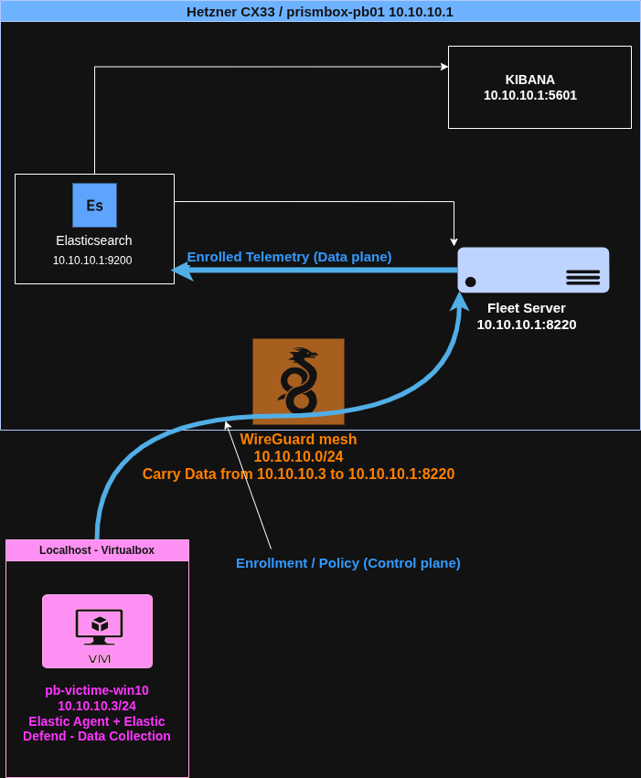

# Operation Prism Box

**A self-built, four-phase detection engineering lab — from a hardened Elastic SIEM foundation
to EDR telemetry, detection-as-code, automated response, and a Microsoft Sentinel mirror.**

Prism Box is a hands-on blue-team lab built on real cloud infrastructure (not a pre-packaged
"click to deploy" range). Every layer is provisioned, configured, secured, and validated by
hand — the goal is deep understanding of *how a detection stack actually works*, end to end,
rather than surface familiarity with a tool's UI.

It follows a three-layer working philosophy carried across the whole portfolio:
**Build** (architect the system) → **Configure** (engineer it correctly and securely) →
**Validate** (verify detections fire on real telemetry).

---

## Approach — a purple-team loop

Prism Box is run as a purple loop, not a red or blue silo. Each operation pairs an
*offensive action* — adversary emulation via Atomic Red Team, mapped to MITRE ATT&CK —
with a *defensive objective*: observe the technique in telemetry, then author and validate
a detection rule that catches it.

This is why the EDR runs in **data-collection mode** rather than prevention. The point is not
to *block* attacks but to *observe how they unfold*, so every technique becomes a visible,
analysable event stream that detection engineering can be practised against. The measure of
success is not "the attack was stopped" but "the attack was seen, understood, and turned into
a durable detection." Red informs blue; blue is where the craft lives — and detection
engineering is the craft this lab exists to build.

---

## Architecture

A single Elasticsearch "brain" runs on a hardened cloud VM (Fleet Server co-located). A Windows
endpoint on separate physical hardware ships EDR telemetry to it across a private WireGuard
tunnel — the SIEM is never exposed to the public internet. Two relationships travel the tunnel:
the endpoint **enrolls** into Fleet Server (control plane) and **ships telemetry** to
Elasticsearch (data plane).



---

## Phases

| Phase | Focus | Status |
|-------|-------|--------|
| **PB-01 — Elastic Foundation** | Single-node Elasticsearch + Kibana on cloud infra, WireGuard admin tunnel, Fleet Server, and Elastic Defend EDR — telemetry flowing end to end. | 🟢 Complete |
| **PB-02 — Detection Engineering** | Atomic Red Team on the endpoint; authoring and validating detection rules against real telemetry. | ⚪ Planned |
| **PB-03 — Automated Response** | Hardening pass + SOAR automation (Shuffle) for response workflows. | ⚪ Planned |
| **PB-04 — Sentinel Mirror** | Microsoft-stack mirror: Defender for Endpoint + Sentinel, KQL translation of the detection logic. | ⚪ Planned |

---

## Tech stack

- **Infrastructure:** Hetzner Cloud (CX33, Ubuntu 24.04 LTS)
- **SIEM:** Elasticsearch + Kibana 9.4.2 (single-node, security + TLS enabled)
- **EDR:** Elastic Agent + Elastic Defend integration (via Fleet, data-collection mode)
- **Networking:** WireGuard (private admin mesh), Hetzner Cloud Firewall
- **Containerization:** Docker Engine + Compose
- **Adversary emulation:** Atomic Red Team *(PB-02)*
- **SOAR:** Shuffle *(PB-03)*
- **Cloud-native mirror:** Microsoft Defender for Endpoint + Sentinel *(PB-04)*

---

## Design principles

- **Secure by default.** The SIEM binds only to the WireGuard interface — zero public exposure.
  TLS and authentication are enabled from the first boot, not bolted on later.
- **Infrastructure and config as the source of truth.** Compose files, tunables, and firewall
  rules are version-controlled; secrets are never committed (see `.gitignore` / `.env.example`).
- **Build with friction, on purpose.** Each layer is done by hand so the failure modes are
  understood, not abstracted away. Troubleshooting is documented, not hidden — see the
  troubleshooting notes in each phase's README.

---

## Repository structure

```
prism-box/
├── README.md
├── LICENSE
├── .gitignore
├── Prism_Box_Ops.drawio.png            # architecture diagram (all four phases)
├── pb-01-elastic-foundation/           # SIEM foundation, WireGuard, Fleet, Elastic Defend
│   ├── README.md                       # full build + troubleshooting write-up
│   ├── docker-compose.yml              # Elastic stack (secrets gitignored)
│   ├── .env.example                    # config template (no secrets)
│   └── *.png                           # verification screenshots
├── pb-02-detection-engineering/
├── pb-03-automated-response/
└── pb-04-sentinel-mirror/
```

---

*Part of a broader detection-engineering portfolio. See also **The Forge** (detection-as-code
CI pipeline) and the **PCAP Autopsy** series (behavioural Suricata rule development).*
