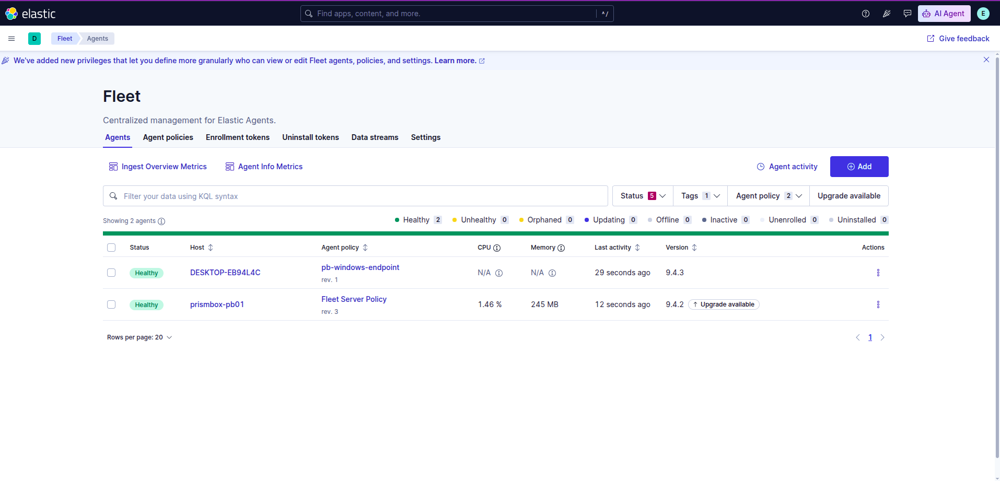
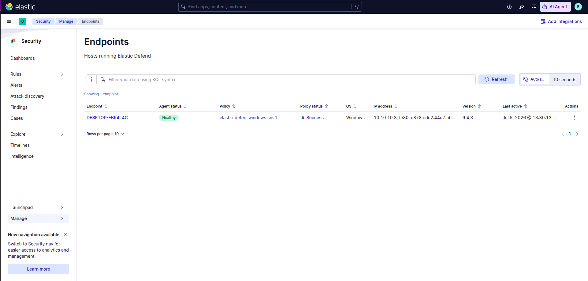
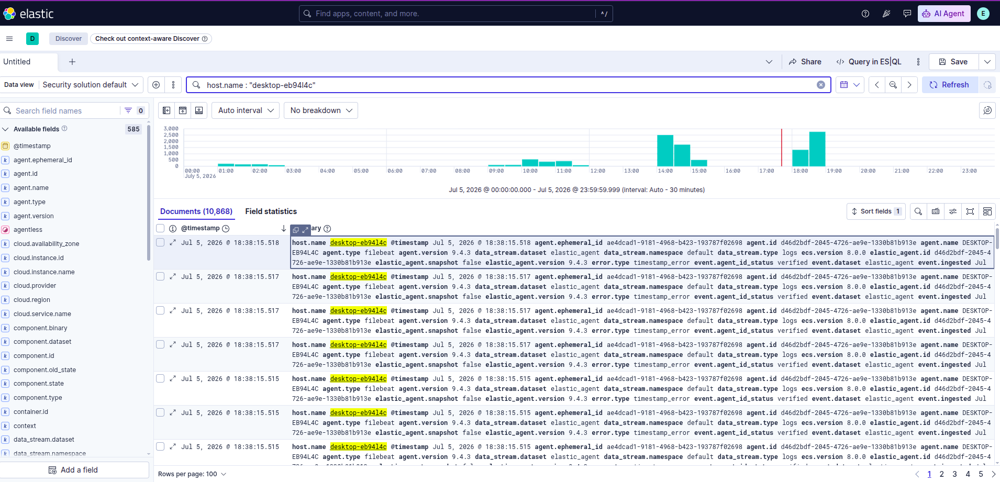
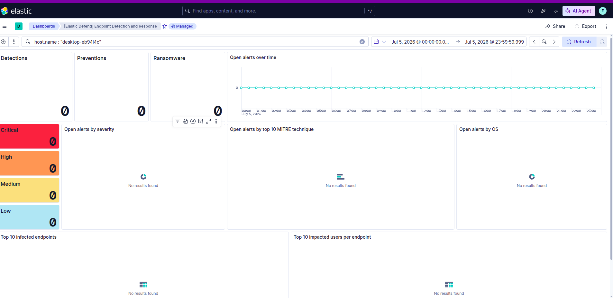

# Prism Box — PB-01: Elastic Foundation

**Status:** Complete · **Phase:** 1 of 4 · **Stack:** Elasticsearch 9.4.2 · Kibana · Fleet Server · Elastic Defend

PB-01 stands up the foundation for the rest of Prism Box: a single-node Elastic
brain, a Fleet Server to manage endpoints, and a Windows victim host streaming
endpoint telemetry through Elastic Defend. By the end of this phase the pipeline
is live end to end — an event generated on the endpoint lands in Elasticsearch
and is queryable in Kibana.

Nothing is detected or blocked yet. That is deliberate. PB-01 builds the
*instrument*; PB-02 onward is where attacks are emulated and detections are
written against the telemetry this phase produces.

> Architecture: see the [Prism Box architecture diagram](../Prism_Box_Ops.drawio.png)
> at the repository root — it covers all four PB phases and the two-host topology
> described below.

---

## Objective

Build a working detection substrate, not a finished detection. Concretely:

- A single-node Elastic stack (Elasticsearch + Kibana) running on a cloud host.
- A Fleet Server for centralised agent management.
- A Windows endpoint enrolled as a Fleet-managed agent.
- Elastic Defend deployed on that endpoint in **data-collection mode** — a sensor,
  not a guard.

The data-collection choice is the purple-team decision that shapes everything
after it. Prism Box is run as a purple loop: each later operation pairs an
offensive action (adversary emulation, mapped to MITRE ATT&CK) with a defensive
objective (see it in telemetry, then write and validate a rule that catches it).
For that loop to work, the endpoint has to *observe* attacks rather than stop
them. Defend in prevention mode would block Atomic Red Team tests before any
detection could see them; in data-collection mode every technique becomes a
visible, analysable event stream. The measure of success here is not "the attack
was stopped" but "the attack was seen" — which is where detection engineering
actually lives.

---

## Topology

Two separate physical hosts, bridged by a WireGuard mesh (`10.10.10.0/24`):

| Host | Role | Address | Runs |
|------|------|---------|------|
| Hetzner CX33 (`prismbox-pb01`) | Elastic brain | `10.10.10.1` | Elasticsearch `:9200`, Kibana `:5601`, Fleet Server `:8220` (all via docker-compose) |
| Local host (VirtualBox) | Endpoint / victim | `10.10.10.3` | `pb-victim-win10` — Elastic Agent + Elastic Defend |

The brain lives in one place; the endpoint dials across the WireGuard tunnel to
reach it. Two relationships travel that tunnel and are worth separating:

- **Control plane** — the Windows agent enrolls into Fleet Server (`:8220`) and
  receives its policy from it.
- **Data plane** — endpoint telemetry flows into Elasticsearch (`:9200`).

Binding the Elastic services to the WireGuard IP (rather than the public
interface) keeps the entire endpoint-to-brain channel inside the encrypted
tunnel — no Elastic port is exposed to the open internet.

---

## Build

### 1. Elastic brain (Hetzner)

Single-node Elasticsearch 9.4.2 + Kibana via docker-compose, published on the
WireGuard IP:

```
elasticsearch → 10.10.10.1:9200
kibana        → 10.10.10.1:5601
```

Elasticsearch 9.x ships with TLS enabled by default, so the stack answers on
`https`, using a self-signed certificate. This detail drives most of what
follows. See `docker-compose.yml` (secrets kept out via `.env.example`).

### 2. Fleet Server

Fleet Server host set to `https://10.10.10.1:8220` in the Quick Start wizard,
then installed as an Elastic Agent on the Hetzner box itself:

```bash
./elastic-agent install \
  --fleet-server-es=https://10.10.10.1:9200 \
  --fleet-server-service-token=<token> \
  --fleet-server-policy=fleet-server-policy \
  --fleet-server-port=8220 \
  --fleet-server-es-insecure \
  --install-servers
```

Two points that were not optional:

- **`https://10.10.10.1:9200`, not `http://localhost:9200`.** The stack uses TLS
  and is bound to the WireGuard IP; a plain-HTTP localhost target simply refuses
  the connection.
- **`--fleet-server-es-insecure`.** The self-signed ES certificate isn't trusted
  by any public CA, so certificate validation is skipped. Acceptable in a lab
  where the traffic already rides inside a WireGuard tunnel; the "do it properly"
  alternative is `--fleet-server-es-ca-trusted-fingerprint`, noted for a later
  hardening pass.

### 3. Windows endpoint enrollment

Fleet-managed enrollment (not standalone), run in an Administrator PowerShell on
`pb-victim-win10`:

```powershell
.\elastic-agent.exe install `
  --url=https://10.10.10.1:8220 `
  --enrollment-token=<token> `
  --insecure
```

`--insecure` appears again here for a *different* self-signed certificate —
Fleet Server's own, presented on `:8220`.

### 4. Elastic Defend

Elastic Defend added to the `pb-windows-endpoint` policy with the **Data
Collection** preset (Traditional Endpoints) — telemetry and detection, no
prevention. The policy pushes to the agent on its next check-in.

---

## Troubleshooting notes

The build did not go clean on the first pass. The failures are recorded here
because the fixes are the useful part.

**Fleet Server enrolled but went Unhealthy.** `elastic-agent status` showed every
component failing with `dial tcp [::1]:9200: connection refused`. Cause: the
`--fleet-server-es` flag only sets the *bootstrap* connection. The *persistent*
output configuration that Fleet stores and pushes back to the agent still pointed
at `localhost`. Fix, in Kibana → **Fleet → Settings → Outputs → default**:

- Hosts → `https://10.10.10.1:9200`
- Advanced YAML → `ssl.verification_mode: none` (the persistent equivalent of
  `--insecure`)

After saving, the agent recovered locally within seconds, but the Kibana banner
took several minutes to catch up. Lesson: trust `elastic-agent status` over the
UI banner — the component health (`[::1]:9200 → EOF → HEALTHY`) tells the real
story before the dashboard does.

**Windows agent unreachable after the VM hibernated.** `Test-NetConnection
10.10.10.1 -Port 8220` returned False and ping failed, while `wg show` on the
server showed the handshake age only growing. The WireGuard interface still held
`10.10.10.3`, but no handshake packets were reaching the server. Root cause: a
VirtualBox NAT stack scrambled by guest hibernation — `ping 8.8.8.8` from the
guest also failed, confirming the outbound path itself was dead, not WireGuard.
Fix: a full cold power-off of the VM (not save-state) rebuilt the virtual NIC and
NAT. Prevention: never hibernate this VM (full shutdown between sessions), and
add `PersistentKeepalive = 25` to the Windows peer to survive idle periods.

---

## Verification

PB-01 is "done" only when telemetry is actually flowing, not when the integration
is merely attached.

**Fleet and endpoint health.** Fleet → Agents shows two agents, both **Healthy** —
`prismbox-pb01` (Fleet Server) and `DESKTOP-EB94L4C` (the Windows endpoint).
Security → Manage → Endpoints lists `DESKTOP-EB94L4C` under "Hosts running Elastic
Defend" with **Policy status: Success** — Defend is actively collecting, not just
installed.




**Raw telemetry is flowing.** Querying `host.name: desktop-eb94l4c` in Discover
returns thousands of events streaming from the endpoint, with activity clustered
around the actual work sessions. This is the data plane working: events generated
on the endpoint are landing in Elasticsearch and are fully queryable.



A distinction worth stating, because it is easy to miss and it matters for
everything after PB-01: Elastic Defend produces two different things.

- **Raw event telemetry** (`event.dataset: endpoint.events.*` — process, file,
  network, library) flows *continuously*, attack or not. This is the firehose a
  detection engineer queries against.
- **Alerts** (the "[Elastic Defend] Endpoint Detection and Response" dashboard)
  only appear when a rule *fires* on something. They are the filtered signal.

**The detection board is empty — on purpose.** The Elastic Defend EDR dashboard
currently reads zero across Detections, Preventions, and alerts by severity /
MITRE technique. That is the *correct* state for PB-01: nothing malicious has been
run yet, so there is nothing to detect. This is the pre-attack baseline. PB-02 is
what populates it — Atomic Red Team techniques generating the suspicious activity
that turns these zeros into detections.



The full chain is live: **endpoint → Elastic Defend → Elastic Agent → Fleet
Server → Elasticsearch → Kibana**, over the WireGuard mesh.

---

## Next: PB-02

With telemetry flowing, PB-02 begins the purple loop proper — Atomic Red Team
techniques run on this endpoint, observed as they unfold, and turned into
detection rules (Sigma / Suricata) validated against the events this phase now
produces. The empty detection board above is what PB-02 sets out to fill.
