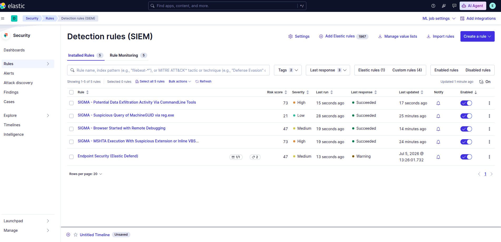

# Magpie — Detection Rules

Detection logic authored from the Magpie correlation phase and deployed as **Elastic Security
detection rules** on PB-02, then **replay-validated** against live alerts.

The correlation phase proved *what fired and what Defender missed*. This phase turns the
sole-coverage gaps into deployed detections and validates each one against real telemetry — not on
paper, but as alerts in Security → Alerts.

> **Scope.** This is the **import-and-adapt** track: canonical [SigmaHQ](https://github.com/SigmaHQ/sigma)
> rules adapted to the PB-02 telemetry, attribution preserved, converted to Elastic detection rules.
> Author-from-scratch rules for the uncovered nodes are **Forge** work (see *Node coverage* below) and
> are deliberately out of scope here.

---

## What was deployed

Four rules, live and replay-validated on `pb-victim-win10` → `prismbox-pb01`:

| Node | Technique | Rule | Severity | Format | Coverage |
|---|---|---|---|---|---|
| 6 | T1082 — System Info Discovery | Suspicious Query of MachineGUID via reg.exe | Low (21) | **Lucene** | sole |
| 2 | T1218.005 — Mshta | MSHTA Execution With Suspicious Extension or Inline VBScript | High (73) | **EQL** | overlap (defense-in-depth over AV) |
| 9 | T1539 — Steal Web Session Cookie | Browser Started with Remote Debugging | Medium (47) | **Lucene** | sole |
| 11 | T1041 — Exfiltration Over C2 | Potential Data Exfiltration Activity Via CommandLine Tools | High (73) | **EQL** | sole |

**Two query languages, on purpose.** Nodes 6 and 9 deploy as Lucene; nodes 2 and 11 required EQL.
This is not arbitrary — it is the single most important finding of this phase, documented in
[The Lucene → EQL finding](#the-lucene--eql-finding) below.



---

## Why only 4 rules for an 11-node chain

Every node was evaluated for detection. Four produced a deployable detection *on this stack*; the
rest have a documented reason. The reasons are distinct and each matters — they are not one vague
"not covered."

| Node | Technique | Disposition | Reason |
|---|---|---|---|
| 1 | T1204.002 — ClickFix RunMRU | **Deferred → Forge** | **Telemetry limit.** The canonical rule keys on the RunMRU *value data* (`registry.data.strings`), which is **null** on this Elastic Defend config — Defend logs the registry *path*, not the written value. The rule imports but cannot fire on this stack. |
| 2 | T1218.005 — Mshta | **Deployed (EQL)** | Adapted from SigmaHQ; overlaps AV (defense-in-depth). |
| 3 | T1059.001 — EncodedCommand | **No rule, by design** | **No artifact.** The atomic ran the AtomicTestHarnesses cmdlet; its `-Execute` produced no `powershell -EncodedCommand` child on either endpoint or SIEM telemetry. There is nothing to detect but the test harness itself. |
| 4 | T1112 — Set-ExecutionPolicy Bypass | **Deferred → Forge** | Author-from-scratch. No canonical *process_creation* rule matches the `Set-ExecutionPolicy` cmdlet form (only a `ps_script`/ScriptBlock rule exists, and ScriptBlock logging is not enabled here). |
| 5 | T1105 — Ingress Tool Transfer | **Deferred → Forge** | **Coverage limit.** No canonical process rule fires on a bare `Net.WebClient.DownloadFile` to GitHub — the WebClient rules all require execution (IEX cradle), obfuscation, suspicious flags, or a bad domain. AV-covered (`Commandrob.A!ml`); the custom rule is author-from-scratch. |
| 6 | T1082 — MachineGUID Discovery | **Deployed (Lucene)** | Adapted from SigmaHQ; canonical fired unchanged. |
| 7 | T1518.001 — Security Software Discovery | **Deferred → Forge** | Author-from-scratch. Defender *enumeration* (`Get-Service WinDefend` / `Get-MpComputerStatus` / `Get-MpThreat`) has no process_creation rule upstream — only Defender *disable/tamper* rules exist. Strongest net-new candidate. |
| 8 | T1555.003 — Browser Credentials | **Deferred → Forge** | Author-from-scratch. The unsigned-collector-sweeping-browser-cred-files behaviour is only partially covered upstream (`file_access` logsource); a scoped rule over `file.path` is Forge work. |
| 9 | T1539 — Steal Web Session Cookie | **Deployed (Lucene)** | Adapted from SigmaHQ; exact match on `--remote-debugging-`. |
| 10 | T1005 — Data from Local System | **Deferred → Forge** | Author-from-scratch. `Compress-Archive` staging is only weakly covered (`ps_script`, low); an FP-tuned rule is Forge work. |
| 11 | T1041 — Exfiltration Over C2 | **Deployed (EQL)** | Adapted from SigmaHQ; fires on the IWR-POST + `Get-Content` pattern. |

**Summary: 4 deployed · 2 deferred (telemetry/coverage) · 1 no-artifact · 4 author-from-scratch.**
The three "kinds" of no-rule are deliberately kept distinct:

- **Telemetry limit** (node 1) — the surface the rule needs is dead in this Defend config.
- **Coverage / author-from-scratch** (nodes 4, 5, 7, 8, 10) — no canonical rule fits; these are the
  Forge queue.
- **No artifact** (node 3) — the technique's own observable never existed to detect.

---

## Method — adapt, attribute, convert, deploy

**1 · Adapt with attribution.** Each rule is a canonical SigmaHQ rule adapted to the PB-02 telemetry.
Provenance is preserved *in the rule*, not in prose:

- the **original author** is retained, with `Yohan Landji (Cyberlandji)` added for the adaptation;
- a `related: [{id: <original-uuid>, type: derived}]` block links to the source rule;
- `references:` point to both the atomic and the upstream rule;
- the **DRL 1.1** licence (SigmaHQ's Detection Rule License) is preserved — attribution is its term,
  so the `related`/author block *is* the licence compliance.

**2 · Convert.** Rules are authored as portable Sigma (`yml/`) and converted with `sigma-cli` +
the Elasticsearch backend to importable Elastic detection rules:

```bash
# Lucene (nodes 6, 9)
sigma convert -t lucene -p ecs_windows -f siem_rule_ndjson <rule>.yml > <rule>_lucene.ndjson

# EQL (nodes 2, 11)
sigma convert -t eql    -p ecs_windows -f siem_rule_ndjson <rule>.yml > <rule>_eql.ndjson
```

`severity`, `risk_score`, and the MITRE ATT&CK mapping are derived automatically from the rule's
`level` and `tags`. The `.yml` is the source of truth; the `.ndjson` is the deployable artifact.

**3 · Deploy.** Import the `.ndjson` in Kibana → **Security → Rules → Detection rules → Import**
(*not* the Relevance "Query rules" feature — different thing, similar name). Set the index pattern to
the Defend data stream (`logs-endpoint.events.process-*`) and enable.

**4 · Validate.** A green **"Succeeded"** in the rules table means the rule *ran without error* — it
does **not** mean it fired. Validation is an **alert in Security → Alerts**. Rules run `from: now-5m`,
so validating against a past detonation is done via **Manual run** over the detonation window; live
replay (`Invoke-AtomicTest <T-id> -TestNumbers <n>`) validates the whole pipeline end to end.

---

## The Lucene → EQL finding

The headline lesson of this phase, and the reason two rules ship as EQL.

**What happened.** All four rules were first deployed as Lucene. Two fired (MachineGUID, Remote
Debugging); two did not (MSHTA, Data Exfiltration) — *no alerts, despite the events being present in
the telemetry.*

**How it was diagnosed** (four layers, each ruled out in turn):

1. **Not timing.** A Manual run explicitly covering the detonation window still produced zero alerts.
2. **Not the logic.** The two rules' Sigma conditions were tested against the *exact captured command
   lines* pulled from Discover — both evaluate **TRUE**. The rules are correct on paper.
3. **Not the field mapping in general.** The two rules that *did* fire query the same
   `process.command_line` / `process.executable` fields.
4. **The cause — Lucene wildcards on space-bearing tokens.** In Discover, a KQL query
   (`process.command_line : *POST* and *Invoke-WebRequest*`) **returned the event**. The Lucene
   rules did not. The difference: the failing rules match on **space-bearing command-line substrings**
   (` -ur`, ` -me`, ` -b`, ` POST `). The Sigma→Lucene conversion escapes those spaces (`*\ POST\ *`),
   and against the whitespace-tokenized `process.command_line` field, a wildcard that must span a
   space cannot match — the space was consumed as a token boundary at index time. The two rules that
   fired match on space-free tokens (`--remote-debugging-`, `MachineGuid`), so Lucene handled them.

**The fix.** Re-convert the two space-dependent rules with the **EQL** backend
(`sigma convert -t eql …`). EQL matches on the full command-line value rather than tokenized wildcards,
so ` POST ` and `vbscript` match the way the KQL query did. Re-imported, manual-run over the window →
**both fired.** Four green.

**Related capture quirk.** The mshta `about:` HTA URI is captured **URL-encoded** — every space is
`%20` (`Run%20"powershell.exe%20-nop…`). The decisive `vbscript` token has no internal space so it
survived, but it is a reminder that the EDR's captured string can differ from the canonical
command line (encoding, casing, quoting), and a `contains|all` on space-bearing tokens is brittle
against exactly that.

**Takeaway.** A rule that is *provably correct on paper* can produce zero alerts because of how the
query language interacts with the field mapping. Signature detection is only as good as the match
between the rule's assumed string and the telemetry's captured string. For command-line detection on
Elastic Defend, **EQL is the more robust target than Lucene** when tokens contain spaces.

### Both formats are kept, on purpose

`lucene/` retains the **non-firing** Lucene versions of the MSHTA and Data Exfiltration rules
alongside the working ones. They are kept for transparency — they *are* the evidence for the finding
above. The deployed format per node is the table at the top of this README; do not import the Lucene
MSHTA / Exfiltration files expecting them to fire.

---

## Validation evidence

| Stage | Screenshot |
|---|---|
| Rules imported and enabled | [`detection_rules.png`](./detection_rules.png) |
| First deployment — **2 of 4** firing (Lucene; MSHTA + Exfil silent) | [`2_alerts_fired.png`](./2_alerts_fired.png) |
| After the EQL fix — **4 of 4** firing | [`4_alerts_fired.png`](./4_alerts_fired.png) |

The two-then-four progression is the point: initial deployment caught two, investigation found why
two were silent, the EQL fix brought it to four. The gap between the screenshots is the debugging
work, not a mistake.

---

## Node-specific validation notes

- **Node 2 (MSHTA) — overlap / defense-in-depth.** Microsoft Defender AV also detects and removes
  this node. The custom rule keys on the process-creation `start` event, which is written at exec
  time and persists despite the later kill — so the alert fires alongside AV, which is the point.
- **Node 9 (Remote Debugging) — fires on the attempt, not the outcome.** The cookie theft *failed*
  against Chrome 151 (Default-profile DevTools hardening, exit -1), but the
  `chrome … --remote-debugging-port` launch is fully captured, so the rule fires regardless of whether
  any cookie was stolen. An alert here is correct, not a false positive.
- **Node 9 alert multiplicity.** A cold Chrome start fans out into many child processes; several carry
  the debug-port flag, so one atomic produces multiple alerts. Count is per matching event, not per
  technique.

---

## Layout

```
rules/
├── README.md                                   # this file
├── detection_rules.png                         # rules imported + enabled
├── 2_alerts_fired.png                          # first deploy: 2/4 (Lucene)
├── 4_alerts_fired.png                          # after EQL fix: 4/4
├── yml/                                         # source of truth (portable Sigma)
│   ├── node02_T1218-005_mshta.yml
│   ├── node06_T1082_machineguid.yml
│   ├── node09_T1539_remote-debugging.yml
│   └── node11_T1041_data-exfiltration.yml
├── lucene/                                      # Lucene ndjson (nodes 6, 9 deployed; 2, 11 kept as non-firing evidence)
│   ├── node02_T1218-005_mshta_lucene.ndjson    # did NOT fire — kept for transparency
│   ├── node06_T1082_machineguid_lucene.ndjson  # deployed
│   ├── node09_T1539_remote-debugging_lucene.ndjson  # deployed
│   └── node11_T1041_data-exfiltration_lucene.ndjson # did NOT fire — kept for transparency
└── eql/                                         # EQL ndjson (nodes 2, 11 deployed)
    ├── node02_T1218-005_mshta_eql.ndjson       # deployed (Lucene missed the spaced tokens)
    └── node11_T1041_data-exfiltration_eql.ndjson   # deployed
```
